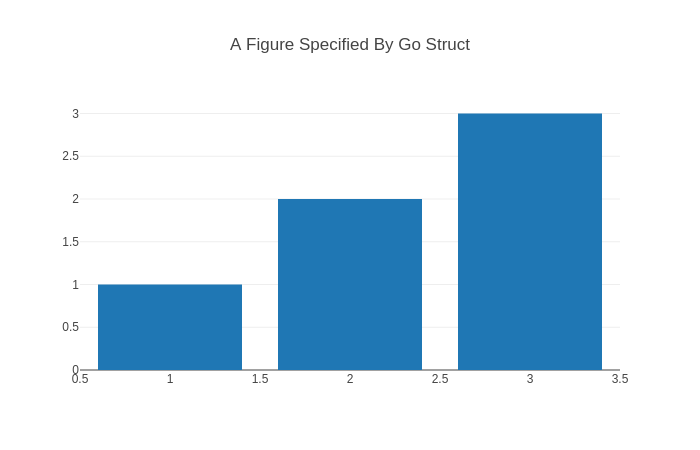

# go-plotly

Inspired by [Python Plotly](https://plotly.com/python/creating-and-updating-figures/)

The goal of the go-plotly package is to provide a pleasant Go interface for creating figure specifications which are displayed by the plotly.js JavaScript graphing library.

In the context of the plotly.js library, a figure is specified by a declarative JSON data structure.

Therefore, you should always keep in mind as you are creating and updating figures using the go-plotly package that its ultimate goal is to help users produce Go structures that can be automatically serialized into the JSON data structure that the plotly.js graphing library understands.

> Yes, that text is a copy paste from Python description.

The good thing about this package is that it's **automatically generated** based on the schema described [here](https://plotly.com/chart-studio-help/json-chart-schema/) so It will be easy to keep it up to date or to generate different versions of it.

## Example

```go
package main

import (
    "github.com/MetalBlueberry/go-plotly/offline"
    "github.com/MetalBlueberry/go-plotly/plotly"
)

func main() {
    fig := &plotly.Fig{
        Data: plotly.Traces{
            &plotly.Bar{
                Type: plotly.TraceTypeBar,
                X:    []float64{1, 2, 3},
                Y:    []float64{1, 2, 3},
            },
        },
        Layout: plotly.Layout{
            Title: &plotly.LayoutTitle{
                Text: "A Figure Specified By Go Struct",
            },
        },
    }

    offline.Show(fig)
}
```

This will open your browser and display the following plot



And that's it.